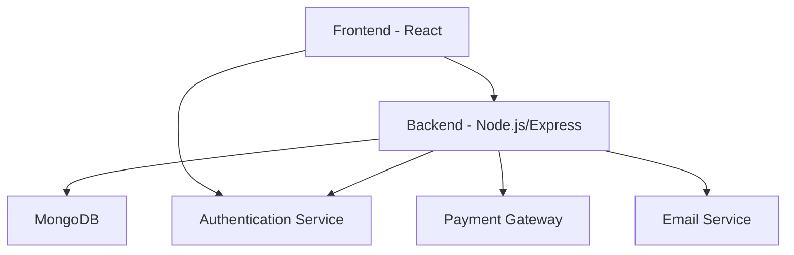

# Shopping App Architecture

## Overview
This document provides an overview of the shopping application architecture, including the main components and their relationships.

## High-Level Architecture

## Frontend Structure

### Buyer Components
- HomePage: Main landing page for buyers
- BuyerHome: Dashboard for authenticated buyers
- ProductListingPage: Browse products by category
- ProductDetailPage: View product details
- CartPage: Shopping cart management
- CheckoutForm: Checkout process
- ProfilePage: User profile management
- OrderTrackingPage: Track order status
- LoginPage/RegisterPage: Authentication pages

### Seller Components
- SellerHomepage: Marketing page for sellers (NEW)
- SellerOnboardingPage: Registration form for new sellers
- SellerDashboard: Main dashboard for sellers
- ProductForm: Add/edit products
- InventoryTable: Manage product inventory
- OrderTable: View and manage orders
- AnalyticsCharts: Sales and performance analytics
- PromotionManager: Manage discounts and promotions
- VerificationStatusCard: Seller verification status
- PaymentSettlementPage: View payment settlements
- SupportChatbotPage: Customer support chat

### Admin Components
- AdminDashboard: Main dashboard for administrators
- UserManagementPage: Manage users (buyers/sellers)
- ProductApprovalPanel: Approve/reject products
- AnalyticsDashboardPage: System-wide analytics
- FraudDetectionPage: Monitor for fraudulent activity

## Backend Structure

### Controllers
- userController: User authentication and management
- productController: Product management
- orderController: Order processing
- paymentController: Payment processing
- analyticsController: Analytics data
- adminController: Administrative functions

### Models
- User: User information (buyers, sellers, admins)
- Product: Product information
- Order: Order details
- Payment: Payment records
- Category: Product categories

### Routes
- /api/users: User authentication and profiles
- /api/products: Product management
- /api/orders: Order processing
- /api/payments: Payment processing
- /api/analytics: Analytics data
- /api/admin: Administrative functions

## New Seller Homepage Features

The new SellerHomepage component includes:

1. **Hero Section**
   - Compelling headline: "Grow Your Business. Sell Directly to Lakhs of Buyers."
   - Subtext about joining the trusted marketplace
   - CTA buttons: "Start Selling Today" and "Learn How It Works"

2. **Value Proposition Section**
   - Expand Your Reach
   - Increase Profits
   - Easy Setup
   - Secure Payments
   - Verified Seller Badge

3. **Who Can Sell Section**
   - Manufacturers
   - Homemade Food Producers
   - Small Retailers & Local Shops
   - Farmers & Organic Sellers
   - Artisans & Creative Entrepreneurs

4. **How It Works Section**
   - Register & Verify
   - List Your Products
   - Start Selling

5. **Earnings & Benefits Section**
   - No heavy commissions
   - Transparent payment system
   - Growth tools
   - Insights dashboard
   - Earnings example

6. **Testimonials Section**
   - Success story from Ramesh Kumar, Handloom Seller

7. **Call-to-Action Banner**
   - "Don't Just Sell. Grow Your Brand."
   - Buttons: "Register as a Seller Now" and "Download the Seller App"

8. **Footer**
   - Help for Sellers
   - Contact information
   - Tagline: "Your Products. Your Customers. Your Growth."

## Navigation

The application has a unified navigation system:
- Buyers access their features through the buyer navigation
- Sellers access their features through the seller navigation
- Admins access their features through the admin navigation
- All users can access the "Sell With Us" marketing page

## Routes

### Public Routes
- / (Buyer Homepage)
- /seller (Seller Marketing Homepage)
- /login
- /register
- /forgot-password

### Buyer Routes
- /home (Buyer Dashboard)
- /products
- /product/:id
- /cart
- /checkout
- /profile
- /order-tracking
- /reviews
- /notifications

### Seller Routes
- /seller (Seller Marketing Homepage)
- /seller/dashboard
- /seller/onboarding
- /seller/portal
- /seller/products
- /seller/inventory
- /seller/orders
- /seller/analytics
- /seller/promotions
- /seller/verification
- /seller/payment-settlement
- /seller/support

### Admin Routes
- /admin
- /admin/dashboard
- /admin/users
- /admin/user-management
- /admin/products
- /admin/analytics
- /admin/fraud-detection

## Services

### Frontend Services
- authService: Authentication functions
- api: HTTP client for backend API calls

### Backend Services
- authService: JWT token generation and validation
- emailService: Email notifications
- paymentService: Payment processing
- imageService: Image upload and management